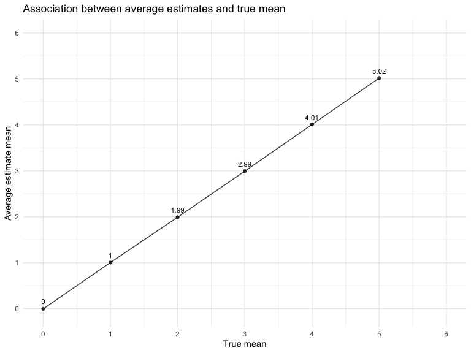
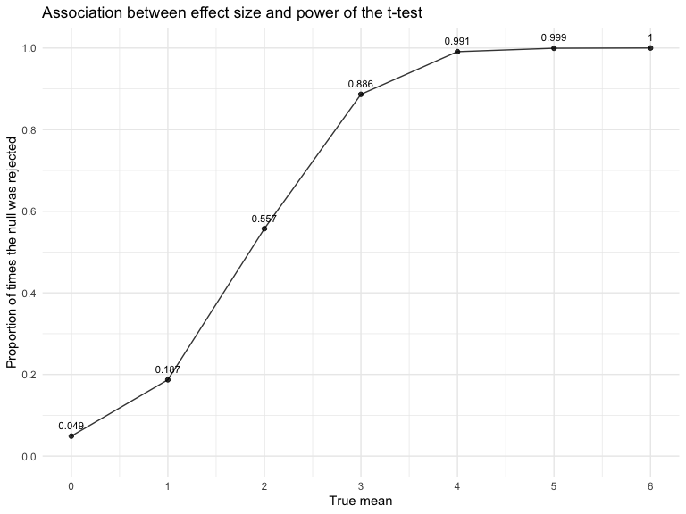
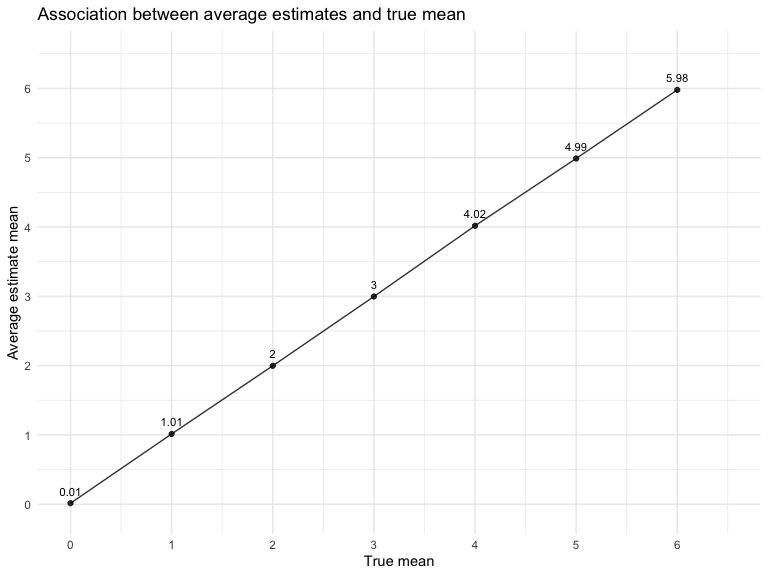
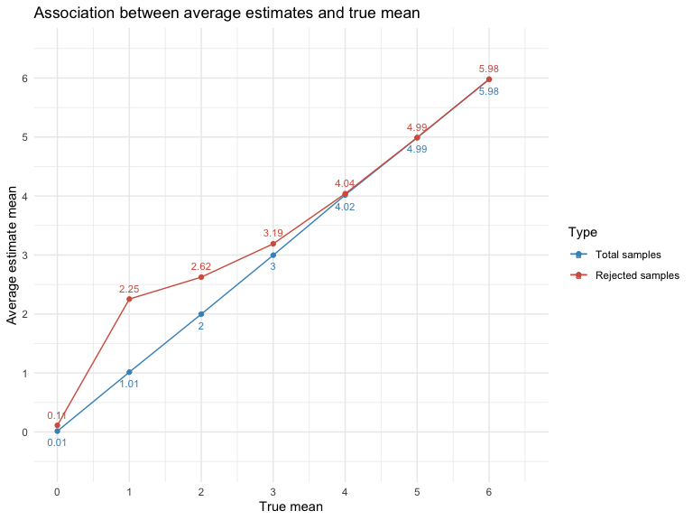

p8105_hw5_yj2687
================
Yijia Jiang
2022-11-16

## Problem 1 (Longitudinal study)

``` r
# Import the dataset
full_df = 
  tibble(
    files = list.files("./p8105_hw5_data/"),
    path = str_c("./p8105_hw5_data/", files)
  ) %>% 
  mutate(data = map(path, read_csv)) %>% 
  unnest()
```

``` r
# Tidy the data
tidy_df = 
  full_df %>% 
  mutate(
    files = str_replace(files, ".csv", ""),
    group = str_sub(files, 1, 3)) %>% 
  pivot_longer(
    week_1:week_8,
    names_to = "week",
    values_to = "outcome",
    names_prefix = "week_") %>% 
  mutate(week = as.numeric(week)) %>% 
  select(group, subj = files, week, outcome)
```

``` r
# Make a spaghetti plot showing observations on each subject over time
tidy_df %>% 
  ggplot(aes(x = week, y = outcome, color = group)) + 
  geom_point() + 
  geom_path() + 
  facet_grid(~group) + 
  labs(x = "Week", y = "Outcome", 
       title = "Observations on Each Subject over 8 Weeks in Two Groups")
```


-   The plot indicates high within-subject correlation – subjects who
    start above average end up above average, and those that start below
    average end up below average. Subjects in the control group
    generally don’t change over time, but those in the experiment group
    increase their outcome in a roughly linear way.

 

## Problem 2 (Homicide Dataset)

``` r
# Import dataset
homicide_raw <- read_csv("https://raw.githubusercontent.com/washingtonpost/data-homicides/master/homicide-data.csv")
```

-   The raw data collected by Washington Post reports a total of 52179
    criminal homicides over the past decade in 50 of the largest
    American cities, including 12 variables, namely uid, reported_date,
    victim_last, victim_first, victim_race, victim_age, victim_sex,
    city, state, lat, lon, disposition.
-   The reported date, longitude and latitude are designated as numeric
    variables, and the remaining 9 variables including age, are defined
    as characters.
-   We can observe some entries for the victim’s race, age, and sex are
    reported as unknown.
-   There exist 60 missing values in `lat`, 60 in `lon`, accounting for
    0.11%, 0.11%, respectively.
-   In particular, there was one record from the city of `Tulsa`, which
    is located in the state of `OK`, was incorrectly logged as being in
    the state of `AL`, which will be removed as a typo.

``` r
# Clean dataset and create variables city_state, resolved
homicide_df = homicide_raw %>% 
  janitor::clean_names() %>%
  mutate(reported_date = as.Date(as.character(reported_date), format = "%Y%m%d")) %>% 
  mutate(
    city_state = str_c(city, state, sep = ", "),
    resolved = case_when(
      disposition == "Closed without arrest" ~ "unsolved",
      disposition == "Open/No arrest" ~ "unsolved",
      disposition == "Closed by arrest" ~ "solved",
    )) %>% 
  relocate(city_state) %>%
  filter(city_state != "Tulsa, AL")
```

``` r
# Summarize within cities to calculate the total number of homicides and unsolved homicides
summary_hom_df = homicide_df %>% 
  group_by(city_state) %>% 
  summarize(
    hom_total = n(),
    hom_unsolved = sum(resolved == "unsolved")
  )

summary_hom_df %>% 
  knitr::kable(align = "lrr", 
               col.names = c("City", "Total number of homicides", "Number of unsovled homicides"))
```

| City               | Total number of homicides | Number of unsovled homicides |
|:-------------------|--------------------------:|-----------------------------:|
| Albuquerque, NM    |                       378 |                          146 |
| Atlanta, GA        |                       973 |                          373 |
| Baltimore, MD      |                      2827 |                         1825 |
| Baton Rouge, LA    |                       424 |                          196 |
| Birmingham, AL     |                       800 |                          347 |
| Boston, MA         |                       614 |                          310 |
| Buffalo, NY        |                       521 |                          319 |
| Charlotte, NC      |                       687 |                          206 |
| Chicago, IL        |                      5535 |                         4073 |
| Cincinnati, OH     |                       694 |                          309 |
| Columbus, OH       |                      1084 |                          575 |
| Dallas, TX         |                      1567 |                          754 |
| Denver, CO         |                       312 |                          169 |
| Detroit, MI        |                      2519 |                         1482 |
| Durham, NC         |                       276 |                          101 |
| Fort Worth, TX     |                       549 |                          255 |
| Fresno, CA         |                       487 |                          169 |
| Houston, TX        |                      2942 |                         1493 |
| Indianapolis, IN   |                      1322 |                          594 |
| Jacksonville, FL   |                      1168 |                          597 |
| Kansas City, MO    |                      1190 |                          486 |
| Las Vegas, NV      |                      1381 |                          572 |
| Long Beach, CA     |                       378 |                          156 |
| Los Angeles, CA    |                      2257 |                         1106 |
| Louisville, KY     |                       576 |                          261 |
| Memphis, TN        |                      1514 |                          483 |
| Miami, FL          |                       744 |                          450 |
| Milwaukee, wI      |                      1115 |                          403 |
| Minneapolis, MN    |                       366 |                          187 |
| Nashville, TN      |                       767 |                          278 |
| New Orleans, LA    |                      1434 |                          930 |
| New York, NY       |                       627 |                          243 |
| Oakland, CA        |                       947 |                          508 |
| Oklahoma City, OK  |                       672 |                          326 |
| Omaha, NE          |                       409 |                          169 |
| Philadelphia, PA   |                      3037 |                         1360 |
| Phoenix, AZ        |                       914 |                          504 |
| Pittsburgh, PA     |                       631 |                          337 |
| Richmond, VA       |                       429 |                          113 |
| Sacramento, CA     |                       376 |                          139 |
| San Antonio, TX    |                       833 |                          357 |
| San Bernardino, CA |                       275 |                          170 |
| San Diego, CA      |                       461 |                          175 |
| San Francisco, CA  |                       663 |                          336 |
| Savannah, GA       |                       246 |                          115 |
| St. Louis, MO      |                      1677 |                          905 |
| Stockton, CA       |                       444 |                          266 |
| Tampa, FL          |                       208 |                           95 |
| Tulsa, OK          |                       583 |                          193 |
| Washington, DC     |                      1345 |                          589 |

``` r
# Estimate the proportion of unsolved homicides in Baltimore, MD
prop_baltimore = prop.test(
  summary_hom_df %>% filter(city_state == "Baltimore, MD") %>% pull(hom_unsolved), 
  summary_hom_df %>% filter(city_state == "Baltimore, MD") %>% pull(hom_total)) 

prop_baltimore %>% broom::tidy()
```

    ## # A tibble: 1 × 8
    ##   estimate statistic  p.value parameter conf.low conf.high method        alter…¹
    ##      <dbl>     <dbl>    <dbl>     <int>    <dbl>     <dbl> <chr>         <chr>  
    ## 1    0.646      239. 6.46e-54         1    0.628     0.663 1-sample pro… two.si…
    ## # … with abbreviated variable name ¹​alternative

``` r
# Iterate to estimate the proportion of unsolved homicides in all cities
prop_cities = 
  summary_hom_df %>% 
  mutate(
    prop_tests = purrr::map2(.x = hom_unsolved, .y = hom_total, ~prop.test(x = .x, n = .y)),
    tidy_tests = purrr::map(.x = prop_tests, ~broom::tidy(.x))
  ) %>% 
  select(-prop_tests) %>% 
  unnest(tidy_tests) %>% 
  select(city_state, estimate, conf.low, conf.high)
```

``` r
# Create a plot showing the estimates and CIs for each city
prop_cities %>% 
  mutate(city_state = fct_reorder(city_state, estimate)) %>% 
  ggplot(aes(x = city_state, y = estimate)) +
  geom_point() + 
  geom_errorbar(aes(ymin = conf.low, ymax = conf.high)) + 
  theme(axis.text.x = element_text(angle = 90, vjust = 0.5, hjust = 1)) +
  labs(
    title = "Estimates and 95% CIs of Proportion of Unsolved Homicides in All Cities",
    x = "City",
    y = "Estimate")
```



 

## Problem 3 (Simulation to Explore Power)

``` r
# Construct function for one-sample t-test
ttest = function(n = 30, mu, sigma = 5){
  sim_data = tibble(x = rnorm(n, mean = mu, sd = sigma)) 
    
  test_data = t.test(sim_data, mu = 0, conf.level = 0.95)
  
  sim_data %>% 
    summarize(
      estimate = pull(broom::tidy(test_data), estimate),
      p_value = pull(broom::tidy(test_data), p.value)
    )
}

# Generate 5000 datasets from the model and repeat the t-test for mu = 0,1,2,3,4,5,6
set.seed(1)

sim_result = 
  tibble(mu = c(0:6)) %>% 
  mutate(
    output_list = map(.x = mu, ~rerun(5000, ttest(mu = .x))),
    estimate_df = map(output_list, bind_rows)
    ) %>% 
  select(-output_list) %>% 
  unnest(estimate_df)
```

``` r
# Make a plot showing the proportion of times the null was rejected on the y axis and the true value of mu on the x axis
sim_result  %>% 
  group_by(mu) %>%
  filter(p_value < 0.05) %>% 
  summarize(rej_num = n(), rej_prop = rej_num/5000) %>% 
  ggplot(aes(x = mu, y = rej_prop)) + 
  geom_point(alpha = 0.8) +
  geom_line(alpha = 0.8) +
  geom_text(aes(label = round(rej_prop, 3)), vjust = -1, size = 3) + 
  scale_x_continuous(limits = c(0,6), breaks = seq(0,6,1)) +
  scale_y_continuous(limits = c(0,1), breaks = seq(0,1,0.2)) +
  labs(
    title = "Association between effect size and power of the t-test",
    x = "True mean",
    y = "Proportion of times the null was rejected")
```



-   With the true mean increases and goes away from 0, the proportion of
    times that the null hypothesis was rejected increases as well,
    approaching to 1. When the difference between true mean and the null
    is large enough, the growth rate of proportion slows down, getting
    closer to 1. The larger the effect size, the greater the power, that
    is, the power of the test is positively correlated with the effect
    size.

``` r
# Make a plot showing the average estimate of mu on the y axis and the true value of mu on the x axis
sim_result %>% 
  group_by(mu) %>% 
  summarise(avg_estimate = mean(estimate)) %>% 
  ggplot(aes(x = mu, y = avg_estimate)) +
  geom_point(alpha = 0.8) +
  geom_line(alpha = 0.8) +
  geom_text(aes(label = round(avg_estimate,2)), vjust = -1, size = 3) + 
  scale_x_continuous(limits = c(0,6.5), breaks = seq(0,6,1)) +
  scale_y_continuous(limits = c(-0.1,6.5), breaks = seq(0,6,1)) +
  labs(
    title = "Association between average estimates and true mean",
    x = "True mean",
    y = "Average estimate mean"
  ) 
```



``` r
# Make a second plot (or overlay on the first) the average estimate of mu only in samples for which the null was rejected on the y axis and the true value of mu on the x axis
sim_rej = sim_result %>% 
  filter(p_value < 0.05) %>% 
  group_by(mu) %>% 
  summarise(avg_estimate = mean(estimate)) 

sim_result %>% 
  group_by(mu) %>% 
  summarise(avg_estimate = mean(estimate)) %>% 
  ggplot(aes(x = mu, y = avg_estimate, color = "Total samples")) +
  geom_point() +
  geom_line() + 
  geom_text(aes(label = round(avg_estimate,2)), vjust = 2, size = 3) + 
  geom_point(data = sim_rej, aes(color = "Rejected samples")) +
  geom_line(data = sim_rej, aes(x = mu, y = avg_estimate, color = "Rejected samples")) + 
  geom_text(data = sim_rej, aes(label = round(avg_estimate,2), color = "Rejected samples"), vjust = -1, size = 3) + 
  scale_x_continuous(limits = c(0,6.5), breaks = seq(0,6,1)) +
  scale_y_continuous(limits = c(-0.5,6.5), breaks = seq(0,6,1)) +
  labs(x = "True mean",
       y = "Average estimate mean",
       title = "Association between average estimates and true mean",
       color = "Type") +
  scale_color_manual(values = c("Total samples" = "#4393C3", "Rejected samples" = "#D6604D"))
```



-   For the total samples, the average estimate means are approximately
    equal to the true means.
-   However, for the rejected samples, when the $\mu$ is equal to 0, 1,
    2 and 3, the sample average of $\hat{\mu}$ across tests for which
    the null is rejected is different from the true value of $\mu$. When
    $\mu$ is equal to 4, 5 and 6, the rejected average estimates are
    close to the true mean of $\mu$.
-   This is because the probability that the null hypothesis is rejected
    increases with effect size increases. When we simulate samples with
    higher true means, we obtain a larger detectable effect size, which
    allows us to reject the null hypothesis more correctly. This again,
    has to do with the statistical power.
