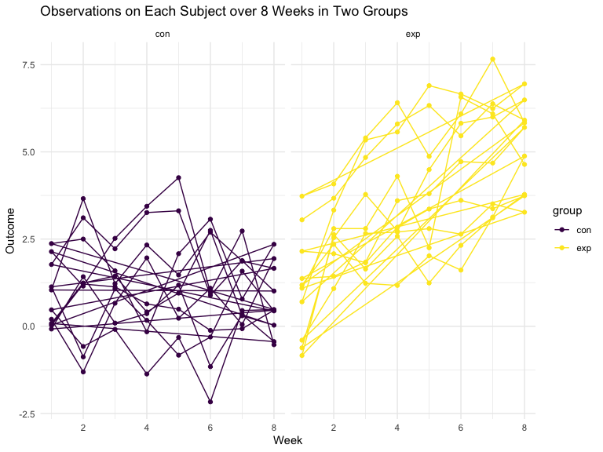

p8105_hw5_yj2687
================
Yijia Jiang
2022-11-06

# Problem 1 (Longitudinal Study)

 

# Problem 2 (Homicide Dataset)

``` r
# Import dataset
homicide_raw <- read_csv(url("https://raw.githubusercontent.com/washingtonpost/data-homicides/master/homicide-data.csv"))
```

-   The raw data collected by Washington Post reports a total of 52179
    criminal homicides over the past decade in 50 of the largest
    American cities, including 12 variables, namely uid, reported_date,
    victim_last, victim_first, victim_race, victim_age, victim_sex,
    city, state, lat, lon, disposition.

``` r
# Clean dataset and create variables city_state, resolved
homicide_df = homicide_raw %>% 
  janitor::clean_names() %>%
  mutate(reported_date = as.Date(as.character(reported_date), format = "%Y%m%d")) %>% 
  mutate(
    city_state = str_c(city, state, sep = ", "),
    resolved = case_when(
      disposition == "Closed without arrest" ~ "unsolved",
      disposition == "Open/No arrest" ~ "unsolved",
      disposition == "Closed by arrest" ~ "solved",
    )) %>% 
  relocate(city_state) %>%
  filter(city_state != "Tulsa, AL")


# Summarize within cities to calculate the total number of homicides and unsolved homicides
summary_hom_df = homicide_df %>% 
  group_by(city_state) %>% 
  summarize(
    hom_total = n(),
    hom_unsolved = sum(resolved == "unsolved")
  )

summary_hom_df 
```

    ## # A tibble: 50 × 3
    ##    city_state      hom_total hom_unsolved
    ##    <chr>               <int>        <int>
    ##  1 Albuquerque, NM       378          146
    ##  2 Atlanta, GA           973          373
    ##  3 Baltimore, MD        2827         1825
    ##  4 Baton Rouge, LA       424          196
    ##  5 Birmingham, AL        800          347
    ##  6 Boston, MA            614          310
    ##  7 Buffalo, NY           521          319
    ##  8 Charlotte, NC         687          206
    ##  9 Chicago, IL          5535         4073
    ## 10 Cincinnati, OH        694          309
    ## # … with 40 more rows

``` r
# Estimate the proportion of unsolved homicides in Baltimore, MD
prop_baltimore = prop.test(
  summary_hom_df %>% filter(city_state == "Baltimore, MD") %>% pull(hom_unsolved), 
  summary_hom_df %>% filter(city_state == "Baltimore, MD") %>% pull(hom_total)) 

prop_baltimore %>% broom::tidy()
```

    ## # A tibble: 1 × 8
    ##   estimate statistic  p.value parameter conf.low conf.high method        alter…¹
    ##      <dbl>     <dbl>    <dbl>     <int>    <dbl>     <dbl> <chr>         <chr>  
    ## 1    0.646      239. 6.46e-54         1    0.628     0.663 1-sample pro… two.si…
    ## # … with abbreviated variable name ¹​alternative

``` r
# Iterate to estimate the proportion of unsolved homicides in all cities
prop_cities = 
  summary_hom_df %>% 
  mutate(
    prop_tests = purrr::map2(.x = hom_unsolved, .y = hom_total, ~prop.test(x = .x, n = .y)),
    tidy_tests = purrr::map(.x = prop_tests, ~broom::tidy(.x))
  ) %>% 
  select(-prop_tests) %>% 
  unnest(tidy_tests) %>% 
  select(city_state, estimate, conf.low, conf.high)

# Create a plot showing the estimates and CIs for each city
prop_cities %>% 
  mutate(city_state = fct_reorder(city_state, estimate)) %>% 
  ggplot(aes(x = city_state, y = estimate)) +
  geom_point() + 
  geom_errorbar(aes(ymin = conf.low, ymax = conf.high)) + 
  theme(axis.text.x = element_text(angle = 90, vjust = 0.5, hjust = 1)) +
  labs(
    title = "Estimates and 95% CIs of Proportion of Unsolved Homicides in All Cities",
    x = "City",
    y = "Estimate")
```



 

# Problem 3 (Simulation to Explore Power)
