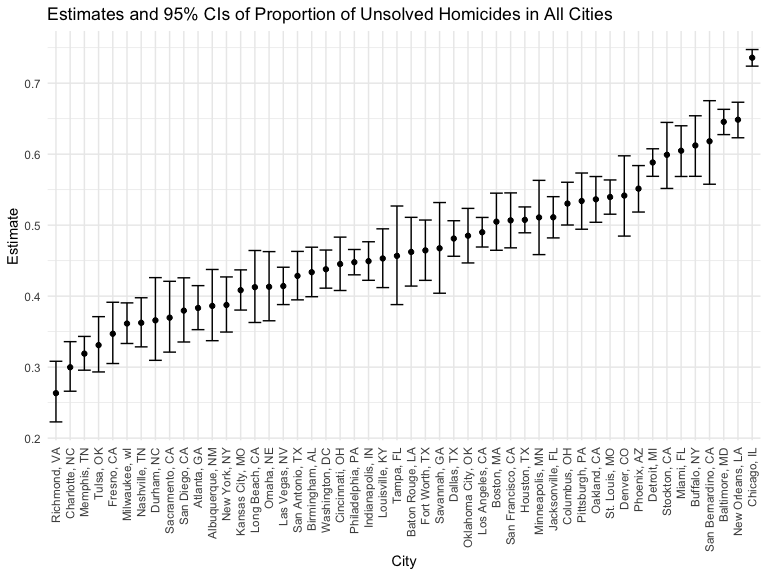

p8105_hw5_yj2687
================
Yijia Jiang
2022-11-06

# Problem 1 (Longitudinal Study)

 

# Problem 2 (Homicide Dataset)

``` r
# Import dataset
homicide_raw <- read_csv("https://raw.githubusercontent.com/washingtonpost/data-homicides/master/homicide-data.csv")
```

-   The raw data collected by Washington Post reports a total of 52179
    criminal homicides over the past decade in 50 of the largest
    American cities, including 12 variables, namely uid, reported_date,
    victim_last, victim_first, victim_race, victim_age, victim_sex,
    city, state, lat, lon, disposition.
-   The reported date, longitude and latitude are designated as numeric
    variables, and the remaining 9 variables including age, are defined
    as characters.
-   We can observe some entries for the victim’s race, age, and sex are
    reported as unknown.
-   There exist 60 missing values in `lat`, 60 in `lon`, accounting for
    0.11%, 0.11%, respectively.
-   In particular, there was one record from the city of `Tulsa`, which
    is located in the state of `OK`, was incorrectly logged as being in
    the state of `AL`, which will be removed as a typo.

``` r
# Clean dataset and create variables city_state, resolved
homicide_df = homicide_raw %>% 
  janitor::clean_names() %>%
  mutate(reported_date = as.Date(as.character(reported_date), format = "%Y%m%d")) %>% 
  mutate(
    city_state = str_c(city, state, sep = ", "),
    resolved = case_when(
      disposition == "Closed without arrest" ~ "unsolved",
      disposition == "Open/No arrest" ~ "unsolved",
      disposition == "Closed by arrest" ~ "solved",
    )) %>% 
  relocate(city_state) %>%
  filter(city_state != "Tulsa, AL")
```

``` r
# Summarize within cities to calculate the total number of homicides and unsolved homicides
summary_hom_df = homicide_df %>% 
  group_by(city_state) %>% 
  summarize(
    hom_total = n(),
    hom_unsolved = sum(resolved == "unsolved")
  )

summary_hom_df %>% 
  knitr::kable(align = "lrr", col.names = c("City", "Total number of homicides", "Number of unsovled homicides"))
```

| City               | Total number of homicides | Number of unsovled homicides |
|:-------------------|--------------------------:|-----------------------------:|
| Albuquerque, NM    |                       378 |                          146 |
| Atlanta, GA        |                       973 |                          373 |
| Baltimore, MD      |                      2827 |                         1825 |
| Baton Rouge, LA    |                       424 |                          196 |
| Birmingham, AL     |                       800 |                          347 |
| Boston, MA         |                       614 |                          310 |
| Buffalo, NY        |                       521 |                          319 |
| Charlotte, NC      |                       687 |                          206 |
| Chicago, IL        |                      5535 |                         4073 |
| Cincinnati, OH     |                       694 |                          309 |
| Columbus, OH       |                      1084 |                          575 |
| Dallas, TX         |                      1567 |                          754 |
| Denver, CO         |                       312 |                          169 |
| Detroit, MI        |                      2519 |                         1482 |
| Durham, NC         |                       276 |                          101 |
| Fort Worth, TX     |                       549 |                          255 |
| Fresno, CA         |                       487 |                          169 |
| Houston, TX        |                      2942 |                         1493 |
| Indianapolis, IN   |                      1322 |                          594 |
| Jacksonville, FL   |                      1168 |                          597 |
| Kansas City, MO    |                      1190 |                          486 |
| Las Vegas, NV      |                      1381 |                          572 |
| Long Beach, CA     |                       378 |                          156 |
| Los Angeles, CA    |                      2257 |                         1106 |
| Louisville, KY     |                       576 |                          261 |
| Memphis, TN        |                      1514 |                          483 |
| Miami, FL          |                       744 |                          450 |
| Milwaukee, wI      |                      1115 |                          403 |
| Minneapolis, MN    |                       366 |                          187 |
| Nashville, TN      |                       767 |                          278 |
| New Orleans, LA    |                      1434 |                          930 |
| New York, NY       |                       627 |                          243 |
| Oakland, CA        |                       947 |                          508 |
| Oklahoma City, OK  |                       672 |                          326 |
| Omaha, NE          |                       409 |                          169 |
| Philadelphia, PA   |                      3037 |                         1360 |
| Phoenix, AZ        |                       914 |                          504 |
| Pittsburgh, PA     |                       631 |                          337 |
| Richmond, VA       |                       429 |                          113 |
| Sacramento, CA     |                       376 |                          139 |
| San Antonio, TX    |                       833 |                          357 |
| San Bernardino, CA |                       275 |                          170 |
| San Diego, CA      |                       461 |                          175 |
| San Francisco, CA  |                       663 |                          336 |
| Savannah, GA       |                       246 |                          115 |
| St. Louis, MO      |                      1677 |                          905 |
| Stockton, CA       |                       444 |                          266 |
| Tampa, FL          |                       208 |                           95 |
| Tulsa, OK          |                       583 |                          193 |
| Washington, DC     |                      1345 |                          589 |

``` r
# Estimate the proportion of unsolved homicides in Baltimore, MD
prop_baltimore = prop.test(
  summary_hom_df %>% filter(city_state == "Baltimore, MD") %>% pull(hom_unsolved), 
  summary_hom_df %>% filter(city_state == "Baltimore, MD") %>% pull(hom_total)) 

prop_baltimore %>% broom::tidy()
```

    ## # A tibble: 1 × 8
    ##   estimate statistic  p.value parameter conf.low conf.high method        alter…¹
    ##      <dbl>     <dbl>    <dbl>     <int>    <dbl>     <dbl> <chr>         <chr>  
    ## 1    0.646      239. 6.46e-54         1    0.628     0.663 1-sample pro… two.si…
    ## # … with abbreviated variable name ¹​alternative

``` r
# Iterate to estimate the proportion of unsolved homicides in all cities
prop_cities = 
  summary_hom_df %>% 
  mutate(
    prop_tests = purrr::map2(.x = hom_unsolved, .y = hom_total, ~prop.test(x = .x, n = .y)),
    tidy_tests = purrr::map(.x = prop_tests, ~broom::tidy(.x))
  ) %>% 
  select(-prop_tests) %>% 
  unnest(tidy_tests) %>% 
  select(city_state, estimate, conf.low, conf.high)
```

``` r
# Create a plot showing the estimates and CIs for each city
prop_cities %>% 
  mutate(city_state = fct_reorder(city_state, estimate)) %>% 
  ggplot(aes(x = city_state, y = estimate)) +
  geom_point() + 
  geom_errorbar(aes(ymin = conf.low, ymax = conf.high)) + 
  theme(axis.text.x = element_text(angle = 90, vjust = 0.5, hjust = 1)) +
  labs(
    title = "Estimates and 95% CIs of Proportion of Unsolved Homicides in All Cities",
    x = "City",
    y = "Estimate")
```



 

# Problem 3 (Simulation to Explore Power)
